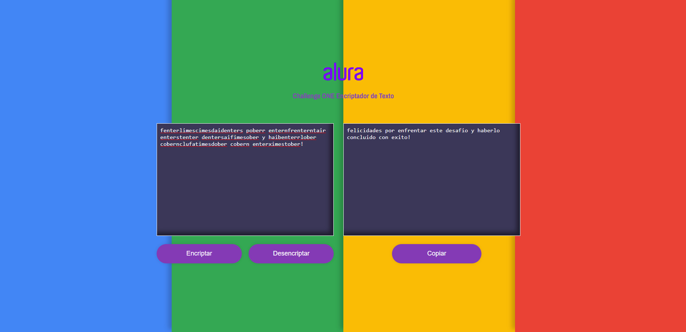
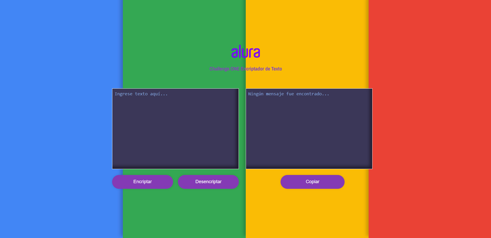

Encriptador de texto - Alura Challenges ONE correspondiente al proyecto principiante en programación

video : https://www.youtube.com/watch?v=qgyAX9-gbUc

https://diegodelias.github.io/Encriptador-de-texto---Alura-Challenges-ONE/

